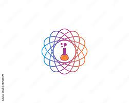

### Hii,👋

<h1 align="left">Hi 👋, I'm PAWAN YADAV</h1>
<h3 align="left">I'm an AI ENGINEER from Noida, India.</h3>

  

  

- 🌱 I’m currently learning **Artificial Intelligence**
- 💬 Ask me about **Python, Machine Learning, Java, Deep Learning, SQL, C**
- 📫 Reach me at **yaduvanshi2000pawan@gmail.com**

---

### Connect with me:

  
  
  
  
  

---

### 🖥️ Languages:

  
  
  
  
  

---

### 🤖 AI & Data Tools:

  
  
  
  
  
  
  
  
  
  

---

### 🗄️ Databases:

  

---

### 🛠️ Other Tools:

  
  
  
  

