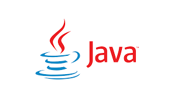
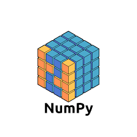
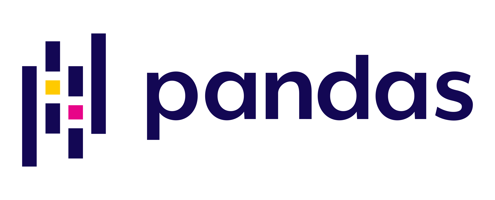
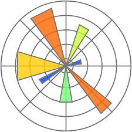
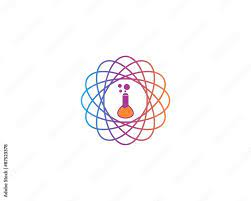

# 👨‍💻 Pawan Yadav
### AI Engineer · Noida, India

  
  
  
  
  
  
  

---

## 🚀 About Me

- 🌱 Currently learning **Artificial Intelligence**
- 🔬 Passionate about **LLMs · AI Agents · Tool Calling · Generative AI**
- 💬 Ask me about **Python, Machine Learning, Java, Deep Learning, SQL, C**
- 📫 Reach me at **yaduvanshi2000pawan@gmail.com**

---

## 📄 Research Publication

> **Prompt-Driven Tool-Calling for Lightweight Open Source LLMs**

**Conference:** 3rd International Conference on Artificial Intelligence and Sustainable Computing for Smart Cities (AIS2C2 2025)  
**Author:** Pawan Yadav · **Pages:** 493–497 · **ISBN:** 978-93-94086-43-2

**What problem does this research address?**

As Large Language Models become more capable, one major challenge remains: *how can smaller, open-source LLMs perform complex tasks without requiring massive computational resources?*

This research explores a **prompt-driven tool-calling framework** that enables lightweight open-source LLMs to:

✅ Use external tools effectively  
✅ Perform multi-step reasoning workflows  
✅ Reduce dependence on large proprietary models  
✅ Move us closer to practical, cost-efficient AI agents in resource-constrained environments

📖 [**Read the Proceedings →**](https://www.aiscindia.co.in/wp-content/uploads/2026/06/ilovepdf_merged-4.pdf)

---

## 🖥️ Languages

  
  
  
  
  

---

## 🤖 AI & Data Tools

  
  
  
  
  
  
  
  
  
  

---

## 🗄️ Databases

  

---

## 🛠️ Other Tools

  
  
  
  

---

## 📊 GitHub Stats

---

*I strongly believe the future of AI is not just about bigger models — it's about making intelligence more accessible, efficient, and deployable in the real world.*

**#ArtificialIntelligence #LLM #AIAgents #ToolCalling #OpenSourceAI #PromptEngineering #GenerativeAI #MachineLearning #DeepLearning #AIResearch #AIEngineer**

